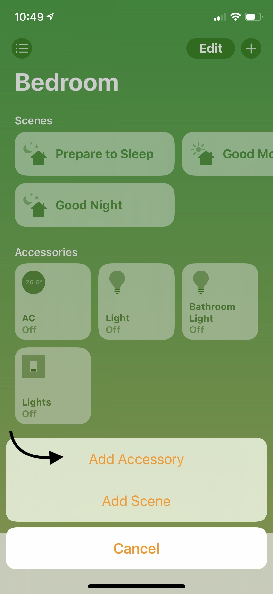
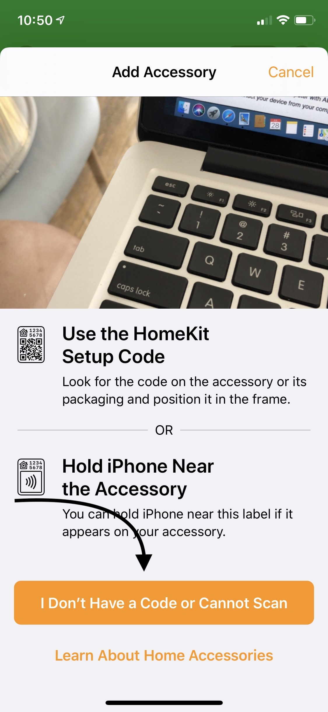
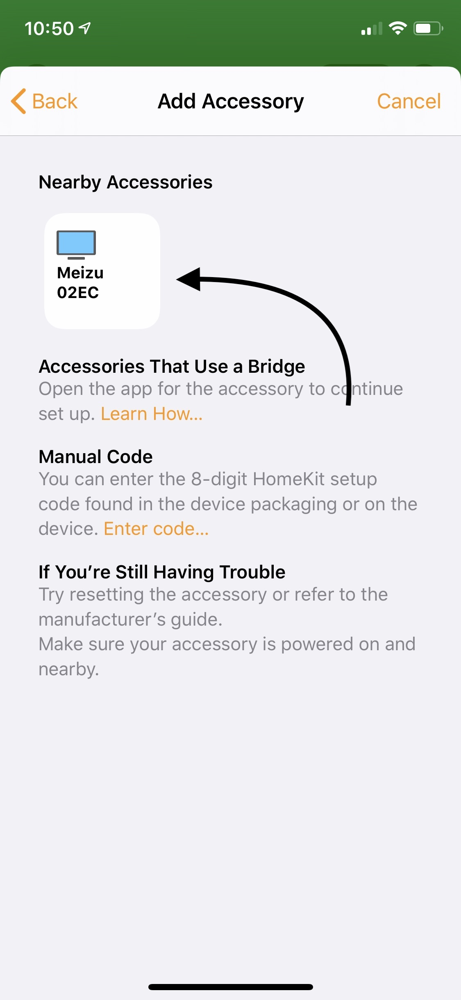
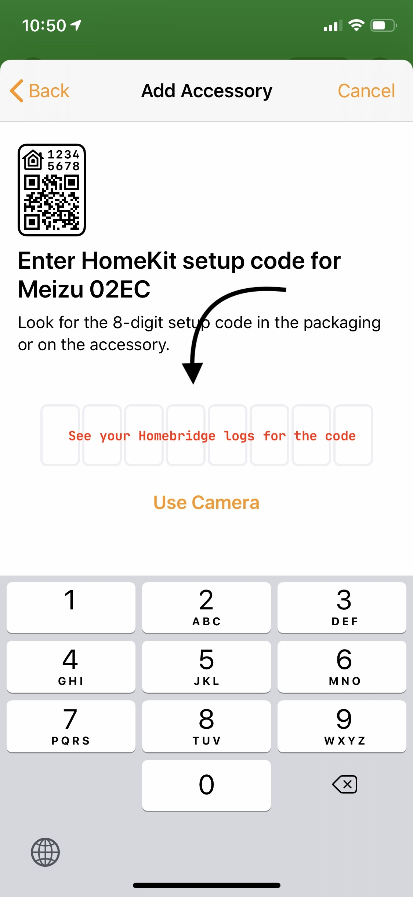

<p align="center">


</p>

# Homebridge ADB

A simple homebridge script to control remote ADB enabled Android device. The idea is to control Android based TV boxes via iOS HomeKit and Home App. The plugin will make your Android device appear as TV accesory, where you can control Volume and D-Pad via Remote inside Control Center, sleep, volume and launch predefined app defined in config.json.

This plugin register as an external accesory, so make sure after you add your Homebridge bridge to your Home App, tap "Add Accesories" to add the device you want to control via Home App.

|||||
|----------|----------|----------|----------|

## Prerequisite

* Install Homebridge (and Homebridge UI X if you want) and this plugins
	```
	sudo npm install -g --unsafe-perm homebridge homebridge-adb
	```

* Make sure you install ADB at the same machine as your Homebridge.
	*  If you're using Ubuntu, use this command:
		```
		sudo apt-get install android-tools-adb android-tools-fastboot
		```
	*  If you're using Alpine Linux (like in the ARM version of oznu/docker-homebridge), use this command:
		```
		apk --update-cache --repository http://dl-3.alpinelinux.org/alpine/edge/testing/ add android-tools
		```
	*  For other OS and method please download it in here: [https://developer.android.com/studio/releases/platform-tools](https://developer.android.com/studio/releases/platform-tools)
	*  When it properly installed, please check your ADB is up and running with this command:

		```
		adb version
		```

* Enable Developer mode in your Android device, visit this documentation to read more
[https://developer.android.com/studio/debug/dev-options](https://developer.android.com/studio/debug/dev-options)

* If your device does not have remote ADB enabled by default, connect your device with USB cable to your server (or any computer with ADB installed) and run:
	```
	adb tcpip 5555
	```
	after that just disconnect the USB cable from your computer.

* Run this command to make sure you can connect to device:
	```
	adb connect your-device-ip
	```
	If all goes well, there will be a popup window in your android device asking for debug permission. After you accept the request, you might want to kill the adb server to make a fresh connection
	```
	adb kill-server
	```
	After that reconnect your device again with previous adb connect. And after that, you should able to run this command
	```
	adb -s your-device-ip shell "getprop ro.product.model"
	```
	and get it will output your device model.


## Configuration

Here an example of configuration that you can use. If you're using Homebridge Config UI X, you can configure your device there, but there's a small bug with Input selection screen. It only displays one input, but if you press add, it will display the rest of the inputs. 

    "platforms": [
        {
            "platform": "HomebridgeADB",
            "accessories": [
                {
                    "name": "NVIDIA Shield",
                    "interval": 1000,
                    "ip": "192.168.1.106",
                    "inputs": [
                        {
                            "name": "HBO Now",
                            "id": "com.hbo.hbonow"
                        },
                        {
                            "name": "Apple Music",
                            "id": "com.apple.android.music"
                        }
                    ]
                },
                {
                    "name": "Meizu",
                    "ip": "192.168.1.121",
                    "inputs": [
                        {
                            "name": "Termux",
                            "id": "com.termux"
                        },
                        {
                            "name": "Apple Music",
                            "id": "com.apple.android.music"
                        }
                    ]
                }
            ]
        }
    ]

* **platform** (mandatory): the name of this plugin.
* **name** (mandatory): the name of the device.
* **ip** (mandatory): the IP address of the device.
* *interval* (optional): if not set, the plugin will check device statuses every 5000 miliseconds.
* *inputs* (optional): by default the plugin will create Home and Other. If set, the plugins will add more input based on the config. To know your app id, please see your Homebridge log.


## ADB command that this script use

* Device name
	```
	adb -s your-device-ip shell "getprop ro.product.manufacturer"
	```
* Device model
	```
	adb -s your-device-ip shell "getprop ro.product.model"
	```
* Device serial number
	```
	adb -s your-device-ip "getprop ro.serialno"
	```
* Send "keyboard" command like up, down, sleep, awake, volume control, etc
	```
	adb -s your-device-ip shell "input keyevent KEYCODE"
	```
* Check device sleep status based on whether secreen is turned on or off
	```
	adb shell 'dumpsys power | grep mHoldingDisplay | cut -d = -f 2'
	```
* Start an app using their package name
	```
	adb -s your-device-ip shell "monkey -p package.name 1"
	```
* Check the current on screen app (Useful for configuring inputs for the plugin config.
	```
	adb -s your-device-ip shell "dumpsys window windows | grep -E mFocusedApp"
	```


## FAQ

* Is this safe?
	* Actually I don't know, it feels very dirty (I need to wash my hand everytime I use this) and hacky, but it works for me.
* I found some bugs, what should I do?
	* You can submit your bugs here [https://github.com/dwaan/homebridge-adb/issues](https://github.com/dwaan/homebridge-adb/issues) or you can help me to fix it by sending pull request.
* Can this plugins do (insert stuff you want to do) to my device?
	* I think so, ADB can basically control your device remotely. If you have other idea for what this can do, you can submit your idea as an issue.
* Can I buy you a beer?
	* No, I don't drink alcohol. But if you like this plugins feel free to stared this repo.
